# HouseScanner

AI-powered house inspection application with computer vision and intelligent checklist generation.

## Screenshots

<table>
   <tr>
      <td></td>
      <td></td>
   </tr>
   <tr>
      <td></td>
      <td></td>
   </tr>
   <tr>
      <td colspan="2" align="center"></td>
   </tr>
</table>

## Tech Stack

- **Frontend:** React, TypeScript, Vite, TailwindCSS
- **Backend:** NestJS, Prisma, PostgreSQL
- **AI/ML:** FastAPI, LangChain, LangGraph, OpenAI
- **Storage:** MinIO (S3-compatible), AWS S3
- **Cache:** Redis
- **Infrastructure:** Docker, Ansible, AWS

### AI Workflow Architecture (LangGraph)

The AI agents service uses **LangGraph** to orchestrate a sophisticated 6-agent pipeline with parallel processing:

```mermaid
flowchart TD
    START([📸 Upload Images]) --> A1[🏠 Agent 1: House Classification]
    A1 --> A2[📋 Agent 2: House Checklist]
    A2 --> PARALLEL[🔄 Parallel Room Processing]
    
    PARALLEL --> A3[🚪 Agent 3: Room Classification]
    PARALLEL --> A4[✅ Agent 4: Room Checklist] 
    PARALLEL --> A5[🛋️ Agent 5: Products Analysis]
    
    A3 --> A6[⚖️ Agent 6: Pros/Cons Analysis]
    A4 --> A6
    A5 --> A6
    
    A6 --> END([📊 Final Report])
    
    classDef startEnd fill:#e1f5fe
    classDef agents fill:#f3e5f5
    classDef parallel fill:#e8f5e8
    
    class START,END startEnd
    class A1,A2,A3,A4,A5,A6 agents
    class PARALLEL parallel
```



**ASCII Flow Diagram:**
```
┌─────────────────┐
│ 📸 Upload Images │
└─────────┬───────┘
          │
          ▼
┌─────────────────────────┐
│ 🏠 Agent 1: House Types │
│    Classification       │
└──────────┬──────────────┘
           │
           ▼
┌─────────────────────────┐
│ 📋 Agent 2: House       │
│    Checklist Evaluation │
└──────────┬──────────────┘
           │
           ▼
┌─────────────────────────┐
│ 🔄 Parallel Processing  │
│ ┌─────────────────────┐ │
│ │🚪 Agent 3: Rooms   │ │ ⚡ 3-5x
│ │✅ Agent 4: Checklist│ │   Faster
│ │🛋️ Agent 5: Products│ │ 
│ └─────────────────────┘ │
└──────────┬──────────────┘
           │
           ▼
┌─────────────────────────┐
│ ⚖️ Agent 6: Pros/Cons   │
│    Final Analysis       │
└──────────┬──────────────┘
           │
           ▼
┌─────────────────┐
│ 📊 Final Report │
└─────────────────┘
```

**Key Features:**
- **Parallel Processing**: Rooms are analyzed concurrently for 3-5x speedup
- **LangSmith Tracing**: Live workflow monitoring at [smith.langchain.com](https://smith.langchain.com)
- **Rate Limiting**: Intelligent throttling (90K TPM, 500 RPM) 
- **State Management**: Persistent checkpointing with memory
- **Error Handling**: Automatic retries with state preservation

**Monitoring**: Visit [LangSmith Dashboard](https://smith.langchain.com) → project: "house-check" to view live execution traces.

---

## Development Setup

### Prerequisites

Install: [Docker Desktop](https://www.docker.com/products/docker-desktop), Python 3.11+, Node.js 18+, Ansible

```bash
pip3 install ansible
```

### Quick Start

```bash
# Clone and setup
git clone https://github.com/InonELGABSI/houseScanner.git
cd houseScanner

# Create environment files
cp client-pwa/.env.template client-pwa/.env
cp backend/.env.template backend/.env
cp agents-service/.env.template agents-service/.env

# Add your OpenAI API key to agents-service/.env
# OPENAI_API_KEY=your-key-here

# Setup infrastructure (DB, Redis, MinIO)
cd ansible && ansible-playbook dev-infra-setup.yml

# Start all services
cd .. && docker compose -f docker-compose.dev.yml up -d
```

### Access Points

- **App:** http://localhost:5173
- **Backend API:** http://localhost:3000/api/v1 ([Docs](http://localhost:3000/api-docs))
- **Agents API:** http://localhost:8000 ([Docs](http://localhost:8000/docs))
- **MinIO Console:** http://localhost:9001 (minio/minio123)
- **Default Login:** housescanner@gmail.com / 12121212

### Common Commands

```bash
# View logs
docker compose -f docker-compose.dev.yml logs -f

# Stop services (keeps data)
docker compose -f docker-compose.dev.yml down

# Reset database
cd ansible && ansible-playbook dev-infra-setup.yml --extra-vars "force_import=true"

# Complete teardown (⚠️ deletes all data)
cd ansible && ansible-playbook dev-infra-teardown.yml --extra-vars "remove_volumes=true"
```

---
---

## Production Deployment

### Prerequisites

- AWS account with CLI configured
- SSH key pair `housescanner-key` in AWS Console (eu-central-1)
- Ansible installed

### Configuration

1. **Setup Secrets:**
   ```bash
   cd ansible/group_vars
   cp secrets.yaml.template secrets.yaml
   # Edit: db_password, aws_access_key_id, aws_secret_access_key, dockerhub credentials
   ansible-vault encrypt secrets.yaml  # Optional
   ```

2. **Update Config:**
   - `ansible/group_vars/env.yaml`: Set unique `s3_bucket_name`, AWS `zone`
   - `backend/.env.prod`: Update `JWT_SECRET`
   - `agents-service/.env.prod`: Update `OPENAI_API_KEY`, `LANGCHAIN_API_KEY`

### Deploy

**Full Deployment:**
```bash
cd ansible
ansible-playbook prod-all-steps.yml  # Provisions AWS + deploys app
```

**Step-by-Step:**
```bash
# 1. Create infrastructure (VPC, EC2, RDS, S3)
ansible-playbook prod-step1-provision-infrastructure.yml

# 2. Build & push Docker images
ansible-playbook prod-step2-build-images.yml

# 3. Deploy to EC2
ansible-playbook prod-step3-deploy-application.yml
```

### Access & Monitor

- **App:** `http://<EC2_IP>:8080`
- **API:** `http://<EC2_IP>:3000/api/v1` ([Docs](http://<EC2_IP>:3000/api-docs))
- **Agents:** `http://<EC2_IP>:8000` ([Docs](http://<EC2_IP>:8000/docs))

```bash
# SSH to EC2
ssh -i ~/.ssh/housescanner-key.pem ubuntu@<EC2_IP>

# Check services
docker ps
docker compose -f docker-compose.prod.yml logs -f
```

### Infrastructure

**Resources:** VPC, EC2 (t3.medium), RDS PostgreSQL (db.t3.micro), S3 bucket  
**Cost:** ~$50-60/month

**Teardown:**
```bash
ansible-playbook prod-teardown.yml  # ⚠️ Deletes all AWS resources
```

---

## Fork & Deploy with GitHub Actions

### 1. Fork & Clone

```bash
git clone https://github.com/YOUR_USERNAME/houseScanner.git
cd houseScanner
```

### 2. Add GitHub Secrets

**Go to:** `Settings` → `Secrets and variables` → `Actions`

| Secret | Description |
|--------|-------------|
| `DOCKERHUB_USERNAME` | DockerHub username |
| `DOCKERHUB_TOKEN` | DockerHub access token |
| `EC2_HOST` | EC2 public IP |
| `EC2_SSH_PRIVATE_KEY` | Contents of `~/.ssh/housescanner-key.pem` |

### 3. Enable Workflows (Currently in `.github/notActive/`)

**Available Workflows:**

- **`deploy-all.yml`** - Deploy all services (manual trigger or push to main)
- **`deploy-backend.yml`** - Deploy backend only (triggers on `backend/**` changes)
- **`deploy-agents.yml`** - Deploy AI service only (triggers on `agents-service/**` changes)
- **`deploy-client.yml`** - Deploy frontend only (triggers on `client-pwa/**` changes)

**Features:** Zero-downtime deployments, health checks, build caching, auto-cleanup

**To Enable:**
```bash
mv .github/notActive/*.yml .github/workflows/
git add .github/workflows/ && git commit -m "Enable CI/CD" && git push
```

**Manual Trigger:** Go to `Actions` tab → Select workflow → `Run workflow`

### 4. Customize & Deploy

Update configs in `ansible/group_vars/` and `.env.prod` files, then:
```bash
# push to trigger GitHub Actions (if enabled)
git push origin main
```

---

## Project Structure

```
├── client-pwa/          # React PWA frontend
├── backend/             # NestJS API
├── agents-service/      # FastAPI AI service
├── ansible/             # Infrastructure automation
│   ├── dev-*           # Local development playbooks
│   └── prod-*          # AWS production playbooks
└── .github/notActive/   # CI/CD workflows (inactive)
```
